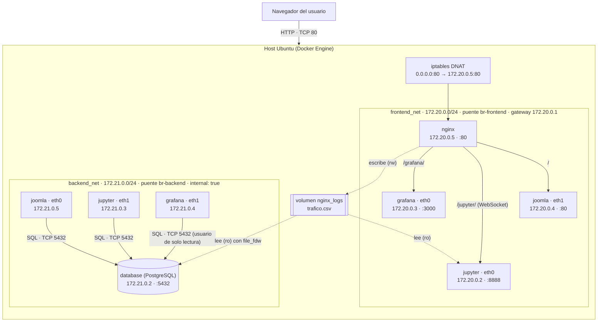
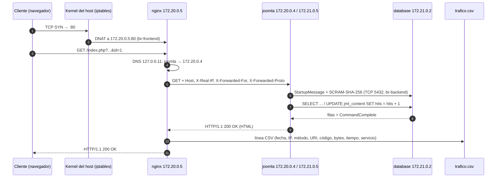
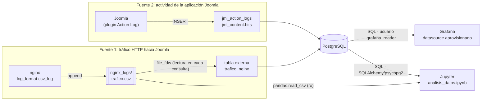
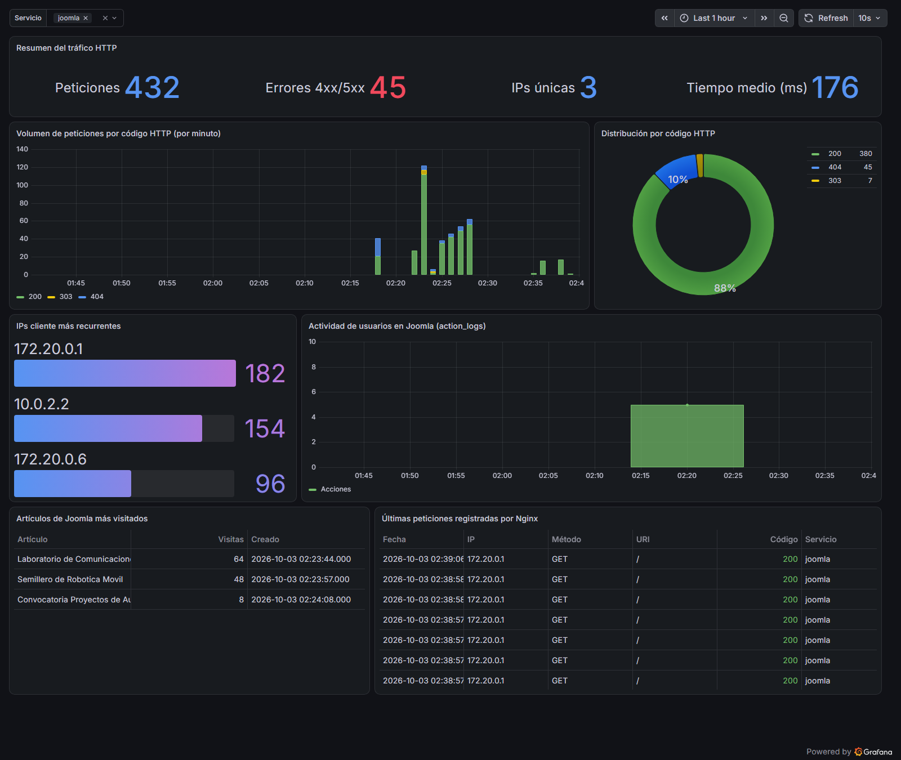
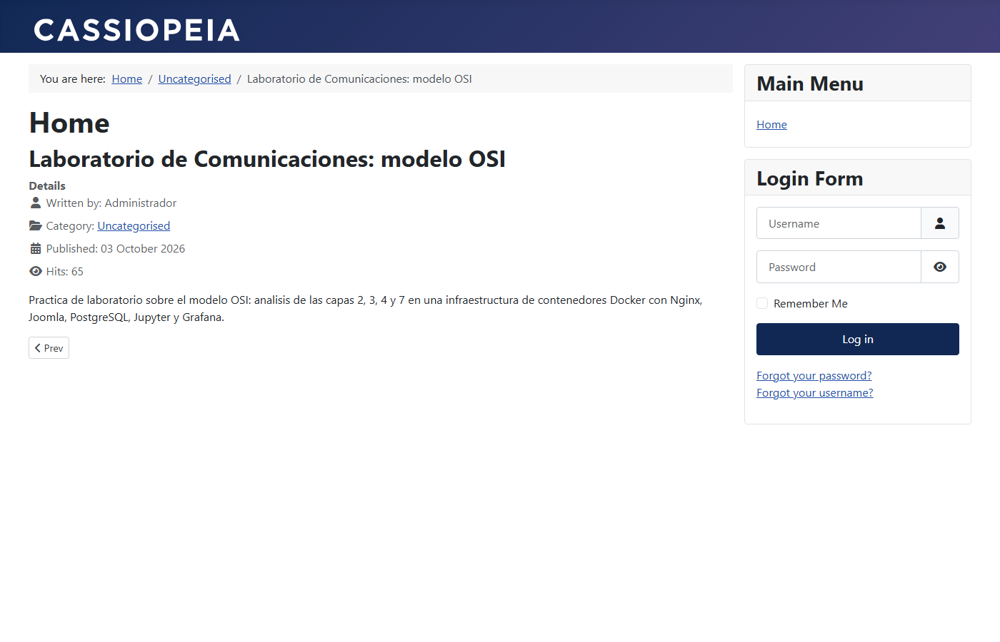
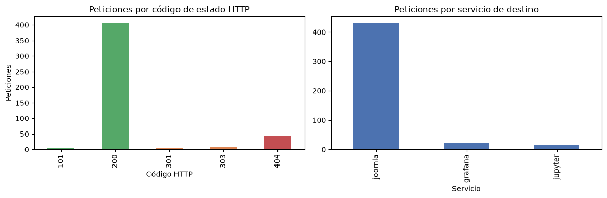

# Informe Técnico – Parcial II

**Despliegue multi-contenedor, orquestación, arquitectura y análisis del modelo OSI**

| | |
|---|---|
| **Asignatura** | Comunicaciones – Ingeniería Mecatrónica |
| **Docente** | Ing. Andrés Julián Moreno M.Sc. |
| **Integrantes** | Juan Velandia · Valeria Talero · Santiago Cabezas |
| **Repositorio** | https://github.com/JuanVelandia78/parcial-redes-comunicaciones |
| **Entorno de pruebas** | Ubuntu 26.04.1 LTS (VirtualBox, 4 vCPU, 4 GB RAM) · Docker Engine con Compose v2 |

> Todas las salidas de comandos que aparecen en este informe son **evidencias reales** tomadas del despliegue en funcionamiento. Los archivos completos están en [`docs/evidencias/`](docs/evidencias/) y se pueden regenerar en cualquier momento con [`docs/evidencias.sh`](docs/evidencias.sh).
>
> Las direcciones IP y MAC de los contenedores **se asignan dinámicamente** dentro de cada subred, así que en otra máquina pueden variar en el último octeto. Las subredes, los gateways y los nombres de los puentes son fijos, porque están declarados en `docker-compose.yml`.

---

## Tabla de contenido

1. [Sección 1: Topología y flujo de información](#sección-1-topología-y-flujo-de-información)
2. [Sección 2: Análisis detallado del modelo OSI](#sección-2-análisis-detallado-del-modelo-osi)
   - [Capa 7: Aplicación](#capa-7-aplicación)
   - [Capa 4: Transporte](#capa-4-transporte)
   - [Capa 3: Red](#capa-3-red)
   - [Capa 2: Enlace de datos](#capa-2-enlace-de-datos)
3. [Sección 3: Guía de verificación y demostración](#sección-3-guía-de-verificación-y-demostración)
4. [Decisiones de diseño, seguridad y mejoras](#decisiones-de-diseño-seguridad-y-mejoras)
5. [Anexo: archivos de evidencia](#anexo-archivos-de-evidencia)

---

## Sección 1: Topología y flujo de información

### 1.1 Servicios desplegados

| # | Servicio | Imagen (versión fijada) | Redes | Puerto interno | Publicado al host |
|---|---|---|---|---|---|
| 1 | `nginx` | `nginx:1.31.6-alpine` | frontend_net | TCP 80 | **80 → 80** (único) |
| 2 | `joomla` | `joomla:6.1.4-php8.4-apache` | frontend_net + backend_net | TCP 80 | No |
| 3 | `database` | `postgres:16-alpine` (16.15) | **solo** backend_net | TCP 5432 | No |
| 4 | `jupyter` | `parcial-jupyter:1.1` (base `quay.io/jupyter/base-notebook:2026-09-29`) | frontend_net + backend_net | TCP 8888 | No |
| 5 | `grafana` | `grafana/grafana:13.2.3` | frontend_net + backend_net | TCP 3000 | No |

### 1.2 Diagrama de arquitectura



**Volúmenes de persistencia:**

| Volumen | Tipo | Montaje | Contenido |
|---|---|---|---|
| `db_data` | nombrado | `database:/var/lib/postgresql/data` | Datos de PostgreSQL |
| `joomla_data` | nombrado | `joomla:/var/www/html` | Código, `configuration.php` e imágenes de Joomla |
| `grafana_data` | nombrado | `grafana:/var/lib/grafana` | Base interna de Grafana (sesiones) |
| `nginx_logs` | nombrado, **compartido** | `nginx:/var/log/nginx` (rw) · `database:/var/log/nginx` (ro) · `jupyter:/home/jovyan/logs` (ro) | `trafico.csv` |
| `./nginx/default.conf` | bind-mount (ro) | `nginx:/etc/nginx/conf.d/default.conf` | Configuración del proxy |
| `./jupyter/notebooks` | bind-mount | `jupyter:/home/jovyan/work` | `analisis_datos.ipynb` |
| `./grafana/provisioning` | bind-mount (ro) | `grafana:/etc/grafana/provisioning` | Datasource y dashboard declarativos |
| `./database/init` | bind-mount (ro) | `database:/docker-entrypoint-initdb.d` | Script de inicialización de PostgreSQL |

### 1.3 Direccionamiento real ([evidencia 02](docs/evidencias/02_redes_docker.txt))

| Contenedor | frontend_net (172.20.0.0/24) | backend_net (172.21.0.0/24) |
|---|---|---|
| gateway (puente del host) | 172.20.0.1 (`br-frontend`) | 172.21.0.1 (`br-backend`) |
| nginx | 172.20.0.5 · MAC `6e:b8:b6:2c:c8:1a` | — |
| joomla | 172.20.0.4 · MAC `b6:2d:64:1d:25:91` | 172.21.0.5 · MAC `7a:47:9e:77:79:e3` |
| jupyter | 172.20.0.2 · MAC `36:0b:81:d4:33:57` | 172.21.0.3 · MAC `7a:73:20:c9:87:83` |
| grafana | 172.20.0.3 · MAC `e2:9d:89:45:dc:f2` | 172.21.0.4 · MAC `0e:33:58:77:f0:43` |
| database | — | 172.21.0.2 · MAC `ba:47:81:b9:0b:f1` |

### 1.4 Flujo de una petición al portal



### 1.5 Mecanismo de recolección de logs y métricas: ¿cómo llegan los eventos de Joomla a Grafana?

Se usan **dos fuentes complementarias**, ambas expuestas como tablas de PostgreSQL. Así Grafana necesita **un único datasource** (el plugin PostgreSQL incluido en Grafana) y no hace falta agregar contenedores extra como Loki o Promtail.



**Fuente 1: log de accesos de Nginx (capa 7, peticiones HTTP).**

1. Toda petición hacia Joomla pasa obligatoriamente por Nginx, que es el único punto de entrada. Nginx la registra en `/var/log/nginx/trafico.csv` con un `log_format` en CSV ([`nginx/default.conf`](nginx/default.conf)):
   ```
   "2026-10-03T07:39:52+00:00","10.0.2.2","GET","/index.php?option=com_content&view=article&id=1","HTTP/1.1",200,3350,0.224,"joomla","Mozilla/5.0 ..."
   ```
   Campos: fecha ISO-8601, IP del cliente, método, URI, protocolo, código HTTP, bytes, tiempo de respuesta (s), servicio de destino (calculado con un `map` sobre la URI) y User-Agent.
2. Ese archivo vive en el volumen **`nginx_logs`**, que también está montado **en solo lectura** en el contenedor `database`.
3. El script [`database/init/01-trafico-nginx.sh`](database/init/01-trafico-nginx.sh) se ejecuta automáticamente la primera vez que arranca PostgreSQL (`/docker-entrypoint-initdb.d`). Activa la extensión **`file_fdw`** (*Foreign Data Wrapper*) y crea la **tabla externa `trafico_nginx`**: PostgreSQL lee el CSV **en el momento de cada consulta**, así que los datos están siempre al día sin procesos intermedios.
4. El mismo script crea el usuario **`grafana_reader`** con permisos **solo de lectura** (`GRANT SELECT`) y `ALTER DEFAULT PRIVILEGES`, de modo que también puede leer las tablas que Joomla crea **después** de la inicialización.

**Fuente 2: registros de actividad de Joomla (aplicación).** Joomla guarda su información directamente en PostgreSQL:
- `jml_action_logs`: el plugin *Action Log* (activo por defecto) registra cada acción de usuario: inicios de sesión, artículos creados o modificados, etc.
- `jml_content.hits`: contador de visitas de cada artículo.

> **¿Por qué no se lee `/var/log/apache2` de Joomla?** En la imagen oficial `joomla` esos archivos son **enlaces simbólicos a la salida estándar** del contenedor (`access.log -> /dev/stdout`, verificado con `ls -la /var/log/apache2`), así que no existe un archivo que compartir por volumen. Por eso el registro de peticiones se toma en el proxy (que ve el 100 % de las peticiones hacia Joomla) y los eventos de la aplicación se toman de las tablas de Joomla.

**Grafana con provisioning (sin configuración manual):**

| Archivo | Función |
|---|---|
| [`grafana/provisioning/datasources/datasource.yml`](grafana/provisioning/datasources/datasource.yml) | Crea el datasource `PostgreSQL-Joomla` (uid fijo `pg-joomla`) hacia `database:5432` con el usuario lector. Las credenciales se inyectan desde variables de entorno (`${GRAFANA_DB_PASSWORD}`). `editable: false` |
| [`grafana/provisioning/dashboards/dashboard.yml`](grafana/provisioning/dashboards/dashboard.yml) | Proveedor de tipo `file` que carga los JSON de la carpeta (`allowUiUpdates: false`, `disableDeletion: true`) |
| [`grafana/provisioning/dashboards/joomla_logs.json`](grafana/provisioning/dashboards/joomla_logs.json) | Dashboard `parcial-trafico` con 7 paneles. Además es el **dashboard de inicio** (`GF_DASHBOARDS_DEFAULT_HOME_DASHBOARD_PATH`) y es visible sin login (rol anónimo *Viewer*) |



*Figura 1. Dashboard aprovisionado: resumen (432 peticiones, 45 errores 4xx, 3 IPs, 176 ms de tiempo medio), volumen por código HTTP, distribución de códigos, IPs recurrentes, actividad de usuarios de Joomla, artículos más visitados y últimas peticiones.*

---

## Sección 2: Análisis detallado del modelo OSI

### Capa 7: Aplicación

#### 7.1 Cabeceras HTTP que inyecta Nginx

Como Nginx actúa de **proxy inverso**, termina la conexión del cliente y abre **una conexión TCP nueva** hacia el servicio interno. Sin información adicional, el servicio solo vería a Nginx como cliente. Por eso Nginx agrega estas cabeceras ([`nginx/default.conf`](nginx/default.conf)):

```nginx
proxy_http_version 1.1;
proxy_set_header Host              $http_host;
proxy_set_header X-Real-IP         $remote_addr;
proxy_set_header X-Forwarded-For   $proxy_add_x_forwarded_for;
proxy_set_header X-Forwarded-Proto $scheme;
proxy_set_header X-Forwarded-Host  $http_host;
proxy_set_header Upgrade           $http_upgrade;
proxy_set_header Connection        $connection_upgrade;
```

Petición real de Nginx a Joomla capturada en el puente `br-frontend` ([evidencia 06](docs/evidencias/06_capa4_capa7_http_nginx_joomla.txt)):

```
IP 172.20.0.5.35934 > 172.20.0.4.80: Flags [P.], length 250: HTTP: GET /index.php?option=com_content&view=article&id=1 HTTP/1.1
        GET /index.php?option=com_content&view=article&id=1 HTTP/1.1
        Host: localhost
        X-Real-IP: 172.20.0.1
        X-Forwarded-For: 172.20.0.1
        X-Forwarded-Proto: http
        X-Forwarded-Host: localhost
        Connection: close
        User-Agent: evidencia-informe
```

| Cabecera | Rol |
|---|---|
| `Host` | Conserva el nombre (y puerto) que escribió el usuario. Sin ella, Joomla recibiría `Host: joomla` (el nombre del upstream) y generaría enlaces absolutos rotos. Se usa `$http_host` en vez de `$host` para conservar también el puerto, por ejemplo `localhost:8090` cuando se entra por un reenvío de puertos |
| `X-Real-IP` | IP del cliente **tal como la ve Nginx** (`$remote_addr`). Es un valor único |
| `X-Forwarded-For` | **Lista** de IPs por las que pasó la petición. `$proxy_add_x_forwarded_for` agrega `$remote_addr` al valor recibido, así que con varios proxies encadenados queda `cliente, proxy1, proxy2` |
| `X-Forwarded-Proto` | Protocolo original (`http`/`https`). Permite que la aplicación genere URLs con el esquema correcto aunque el tramo interno sea HTTP |
| `X-Forwarded-Host` | Host original, que usan algunas aplicaciones para construir redirecciones |
| `Connection: close` | Al no haber `Upgrade`, el `map` asigna `close`: Nginx abre una conexión por petición hacia el upstream (ver capa 4) |

**Uso efectivo de estas cabeceras.** La imagen de Joomla trae activo `mod_remoteip` de Apache, que reemplaza la IP de la conexión (la de Nginx) por la indicada en `X-Forwarded-For`. Por eso el log de Apache registra al **cliente real** y no a Nginx:

```
10.0.2.2 - - [03/Oct/2026:07:39:51 +0000] "GET /index.php?option=com_content&view=article&id=1 HTTP/1.1" 200 3992 "-" "Mozilla/5.0 ... HeadlessChrome/154.0.0.0 ..."
```

Jupyter hace lo mismo gracias a `--ServerApp.trust_xheaders=True`.

> **Dos IPs de cliente distintas, `172.20.0.1` y `10.0.2.2`.** Las peticiones hechas desde el propio host a `localhost:80` las atiende el proceso `docker-proxy` (*userland proxy*), que reabre la conexión desde el gateway del puente, por eso aparece **172.20.0.1**. Las que llegan desde fuera de la VM entran por la regla DNAT del kernel, que **conserva la IP de origen**: **10.0.2.2** es la puerta de enlace del NAT de VirtualBox, por donde entra el tráfico del navegador de Windows. Ambas aparecen en el panel "IPs cliente más recurrentes" (Figura 1).

#### 7.2 HTTP Upgrade y WebSockets del kernel de Jupyter

JupyterLab se comunica con el kernel de Python mediante **WebSockets** (`/jupyter/api/kernels/<id>/channels`). Un WebSocket **empieza como una petición HTTP/1.1** y luego, con el mecanismo **Upgrade** (RFC 6455 / RFC 9110 §7.8), la **misma conexión TCP** cambia a un protocolo binario bidireccional y persistente.

Las cabeceras `Upgrade` y `Connection` son **hop-by-hop**: un proxy no las reenvía por defecto. Por eso hay que reenviarlas de forma explícita:

```nginx
map $http_upgrade $connection_upgrade {   # Upgrade: websocket -> Connection: upgrade
    default  upgrade;                     # sin Upgrade         -> Connection: close
    ''       close;
}
location /jupyter/ {
    proxy_pass $destino_jupyter;
    proxy_read_timeout 86400s;   # el WebSocket puede estar inactivo largo tiempo
    proxy_send_timeout 86400s;
    proxy_buffering off;         # salidas de las celdas en tiempo real
}
```

Además, `proxy_http_version 1.1` es imprescindible, porque **HTTP/1.0 no tiene mecanismo Upgrade**. Prueba del saludo WebSocket a través de Nginx ([evidencia 08](docs/evidencias/08_capa7_websocket_jupyter.txt)):

```
$ curl -i -N -H "Connection: Upgrade" -H "Upgrade: websocket" -H "Sec-WebSocket-Version: 13" \
       -H "Sec-WebSocket-Key: SGVsbG8sIHdvcmxkIQ==" http://localhost/jupyter/api/events/subscribe?token=...
HTTP/1.1 101 Switching Protocols
Server: nginx/1.31.6
Connection: upgrade
Upgrade: websocket
```

El código **101 Switching Protocols** confirma que el servidor aceptó el cambio de protocolo. En el log CSV de Nginx esas conexiones quedan registradas con código `101` y una duración de varios segundos, la vida del WebSocket:

```
"2026-10-03T07:39:57+00:00","10.0.2.2","GET","/jupyter/api/events/subscribe","HTTP/1.1",101,1990,2.718,"jupyter","Mozilla/5.0 ..."
```

Si faltara cualquiera de estas directivas, JupyterLab cargaría la interfaz pero mostraría **"Kernel connection error"**.

#### 7.3 Protocolo cliente/servidor de PostgreSQL

PostgreSQL usa su propio protocolo de aplicación (*Frontend/Backend Protocol v3*) sobre TCP 5432. Cada mensaje tiene un **tipo de 1 byte**, una **longitud de 4 bytes** y un contenido. Captura real en `br-backend` de una conexión de Jupyter ([evidencia 07](docs/evidencias/07_capa7_protocolo_postgresql.txt)):

```
172.21.0.3.55654 > 172.21.0.2.5432: Flags [S]   ...                       ← saludo TCP
172.21.0.3.55654 > 172.21.0.2.5432: Flags [P.], length 8                   ← SSLRequest
172.21.0.2.5432 > 172.21.0.3.55654: Flags [P.], length 1                   ← 'N' (sin TLS)
172.21.0.3.55654 > 172.21.0.2.5432: Flags [P.], length 80
   user.joomla_user.database.joomla_db.application_name.evidencia-informe  ← StartupMessage
172.21.0.2.5432 > 172.21.0.3.55654: length 24   SCRAM-SHA-256              ← AuthenticationSASL
172.21.0.3.55654 > 172.21.0.2.5432: length 55   SCRAM-SHA-256 n,,n=,r=...  ← SASLInitialResponse
...                                             v=b7MbzN...  in_hot_standby, TimeZone.UTC  ← SASLFinal + ParameterStatus
172.21.0.3.55654 > 172.21.0.2.5432: length 38   Q ... SELECT count(*) FROM jml_content   ← Query
172.21.0.2.5432 > 172.21.0.3.55654: length 63   T count ... D ... 3 C SELECT 1 Z        ← RowDescription, DataRow, CommandComplete, ReadyForQuery
172.21.0.3.55654 > 172.21.0.2.5432: length 5                               ← Terminate ('X')
172.21.0.3.55654 > 172.21.0.2.5432: Flags [F.]                             ← cierre TCP
```

| Fase | Mensajes | Observación |
|---|---|---|
| Negociación de cifrado | `SSLRequest` (8 bytes) → `N` | El servidor responde `N`: la conexión sigue en claro. Es aceptable porque el tráfico **nunca sale de `backend_net`** (ver mejoras) |
| Inicio | `StartupMessage` | Viajan en texto el usuario, la base de datos y el `application_name` |
| Autenticación | `AuthenticationSASL` → `SASLInitialResponse` → `SASLContinue` → `SASLFinal` | **SCRAM-SHA-256**: la contraseña **nunca viaja**. Se intercambian *nonces* y pruebas criptográficas |
| Parámetros | `ParameterStatus` (`TimeZone=UTC`, `integer_datetimes`, ...), `BackendKeyData`, `ReadyForQuery` | El servidor informa su configuración |
| Consulta simple | `Query ('Q')` → `RowDescription ('T')` + `DataRow ('D')` + `CommandComplete ('C')` + `ReadyForQuery ('Z')` | El resultado (3 artículos) viaja como texto en el `DataRow` |
| Cierre | `Terminate ('X')` + FIN TCP | |

Joomla usa el mismo protocolo mediante el driver PDO `pgsql` (`$dbtype = 'pgsql'`, `$host = 'database'` en `configuration.php`), Grafana mediante su driver Go y Jupyter mediante `psycopg2`.

#### 7.4 Formato y estructura de los logs de Joomla

| Origen | Formato | Ejemplo real |
|---|---|---|
| Apache (dentro de `joomla`, va a la salida estándar → `docker compose logs joomla`) | *Combined Log Format*: `%a %l %u %t "%r" %>s %O "%{Referer}i" "%{User-Agent}i"` | `10.0.2.2 - - [03/Oct/2026:07:39:51 +0000] "GET /index.php?option=com_content&view=article&id=1 HTTP/1.1" 200 3992 "-" "Mozilla/5.0 ..."` |
| Nginx: `trafico.csv` (archivo compartido) | CSV de 10 campos (ver 1.5) | `"2026-10-03T07:39:52+00:00","10.0.2.2","GET","/index.php?...&id=1","HTTP/1.1",200,3350,0.224,"joomla","Mozilla/5.0 ..."` |
| Joomla: tabla `jml_action_logs` | Fila relacional + mensaje JSON | ver abajo |

Estructura de `jml_action_logs` y registros reales:

```
 Column               | Type
----------------------+-----------------------------
 id                   | integer (PK)
 message_language_key | character varying(255)
 message              | text  (JSON)
 log_date             | timestamp without time zone
 extension            | character varying(50)
 user_id              | integer
 item_id              | integer
 ip_address           | character varying(40)

 id | message_language_key                | log_date            | extension           | user_id | item_id
----+-------------------------------------+---------------------+---------------------+---------+--------
  1 | PLG_ACTIONLOG_JOOMLA_USER_LOGGED_IN | 2026-10-03 07:23:08 | com_users           |     765 |       0
  3 | PLG_SYSTEM_ACTIONLOGS_CONTENT_ADDED | 2026-10-03 07:23:44 | com_content.article |     765 |       1

 message (id 1): {"action":"login","userid":765,"username":"admin","app":"PLG_ACTIONLOG_JOOMLA_APPLICATION_ADMINISTRATOR", ...}
```

La columna `ip_address` muestra `COM_ACTIONLOGS_DISABLED` porque, por privacidad, Joomla no guarda la IP en este registro mientras no se active la opción. La IP queda registrada en el log de Nginx.

---

### Capa 4: Transporte

#### 4.1 Puertos TCP involucrados

| Puerto | Proceso | Dónde escucha | Visible desde |
|---|---|---|---|
| **80** | Nginx | `0.0.0.0:80` del host → DNAT → `172.20.0.5:80` | Cualquier cliente (único puerto publicado) |
| 80 | Apache (Joomla) | `172.20.0.4:80` | Solo `frontend_net` (Nginx) |
| 8888 | Jupyter Server | `172.20.0.2:8888` | Solo `frontend_net` (Nginx) |
| 3000 | Grafana | `172.20.0.3:3000` | Solo `frontend_net` (Nginx) |
| **5432** | PostgreSQL | `172.21.0.2:5432` | Solo `backend_net` (Joomla, Jupyter, Grafana) |
| 53 (UDP/TCP) | DNS embebido de Docker | `127.0.0.11:53` en cada contenedor (redirigido a un puerto alto, ver 3.2) | Cada contenedor |
| efímeros (32768–60999) | Clientes | Origen de cada conexión saliente, por ejemplo `172.20.0.5:35934` | — |

Puertos en escucha **en el host** ([evidencia 11](docs/evidencias/11_capa3_nat_host.txt)): solo `0.0.0.0:80` pertenece al proyecto. El `5432`, el `8888` y el `3000` **no aparecen**, y `ss -tln | grep 5432` no devuelve nada ([evidencia 12](docs/evidencias/12_aislamiento_backend.txt)).

#### 4.2 Establecimiento y cierre de conexiones

Captura de la conexión Nginx → Joomla ([evidencia 06](docs/evidencias/06_capa4_capa7_http_nginx_joomla.txt)):

```
07:38:23 IP 172.20.0.5.35934 > 172.20.0.4.80: Flags [S],  seq 152623316, win 64240, options [mss 1460,sackOK,TS,nop,wscale 9]
07:38:23 IP 172.20.0.4.80 > 172.20.0.5.35934: Flags [S.], seq 1606871633, ack 152623317, win 65160, options [mss 1460,...]
07:38:23 IP 172.20.0.5.35934 > 172.20.0.4.80: Flags [.],  ack 1
07:38:23 IP 172.20.0.5.35934 > 172.20.0.4.80: Flags [P.], seq 1:251   ← petición HTTP (250 bytes)
07:38:23 IP 172.20.0.4.80 > 172.20.0.5.35934: Flags [P.], seq 1:7241  ← respuesta en varios segmentos
...
07:38:23 IP 172.20.0.4.80 > 172.20.0.5.35934: Flags [F.]               ← Joomla cierra (Connection: close)
07:38:23 IP 172.20.0.5.35934 > 172.20.0.4.80: Flags [F.]
07:38:23 IP 172.20.0.4.80 > 172.20.0.5.35934: Flags [.],  ack 252
```

- **Saludo de tres vías** (`SYN` → `SYN-ACK` → `ACK`): se negocian el MSS (1460 = MTU 1500 − 40 de cabeceras IP+TCP), SACK, marcas de tiempo y escalado de ventana (`wscale 9`).
- **Transferencia**: la respuesta de 12 296 bytes viaja en varios segmentos `PSH`, y cada uno se confirma con `ACK`.
- **Cierre**: intercambio de `FIN`. El extremo que cierra primero queda en **TIME-WAIT** (2×MSL) para absorber segmentos retrasados.

#### 4.3 Conexiones concurrentes y persistentes (keep-alive / connection pooling)

Se compararon los tres clientes de PostgreSQL y el tramo Nginx → upstream ([evidencia 09](docs/evidencias/09_capa4_conexiones_pool.txt)):

**a) Grafana → PostgreSQL: pool de conexiones persistentes.** El datasource declara un pool (`maxOpenConns: 10`, `maxIdleConns: 5`, `connMaxLifetime: 14400`). Después de **6 consultas** al datasource, PostgreSQL muestra **una sola conexión** de Grafana, **reutilizada** y en estado `idle`:

```
 pid  |    usename     | client_addr | state | inicio
------+----------------+-------------+-------+----------
 1357 | grafana_reader | 172.21.0.4  | idle  | 07:38:52

$ ss -tn   (namespace de grafana)
ESTAB 0 0  172.21.0.4:32946  172.21.0.2:5432
```

Las 6 consultas no pagaron de nuevo el saludo TCP ni la autenticación SCRAM: esa es la ventaja del *pooling*.

**b) Joomla (PHP) → PostgreSQL: una conexión por petición HTTP.** PHP con Apache no mantiene conexiones persistentes (`pgsql` sin `persistent`): cada petición abre la conexión, consulta y cierra. Después de 15 peticiones al portal quedan **13 conexiones distintas en TIME-WAIT** hacia `172.21.0.2:5432` (prácticamente una por petición; cada una usó un puerto efímero diferente):

```
$ ss -tan state time-wait '( dport = :5432 )'   (namespace de joomla)
172.21.0.5:54412   172.21.0.2:5432
172.21.0.5:57998   172.21.0.2:5432
172.21.0.5:34980   172.21.0.2:5432
... (13 conexiones)
```

**c) Nginx → upstreams.** Como `Connection` se fija en `close` cuando no hay WebSocket y no hay un bloque `upstream` con `keepalive`, Nginx abre **una conexión TCP por petición** hacia Joomla. El namespace de Nginx muestra muchas conexiones `172.20.0.5:* → 172.20.0.4:80` en TIME-WAIT. Hacia el cliente, en cambio, Nginx sí usa **HTTP keep-alive** (por defecto `keepalive_timeout 65s`): el navegador reutiliza la misma conexión para descargar HTML, CSS y JS.

**d) Jupyter → PostgreSQL.** SQLAlchemy crea un `QueuePool` (5 conexiones por defecto) que vive mientras vive el kernel, así que las celdas reutilizan la conexión.

**e) WebSocket.** Es la conexión más persistente: una sola conexión TCP permanece abierta mientras el cuaderno está abierto, con `proxy_read_timeout 86400s`.

**Concurrencia.** Nginx atiende muchas conexiones simultáneas con un modelo **asíncrono por eventos** (`worker_processes auto` × `worker_connections`). Apache usa procesos o hilos por conexión, y PostgreSQL crea un **proceso backend por conexión** (el `pid` de `pg_stat_activity`). Por eso el *pooling* es importante del lado de la base de datos.

| Tramo | Estrategia observada | Efecto |
|---|---|---|
| Cliente ↔ Nginx | HTTP keep-alive | Menos saludos TCP para el navegador |
| Nginx ↔ Joomla | Una conexión por petición (`Connection: close`) | Simple. Costo: un saludo TCP extra por petición (≈ 0,04 ms entre SYN y ACK en la red local) |
| Joomla ↔ PostgreSQL | Una conexión por petición | Un proceso backend por petición |
| Grafana ↔ PostgreSQL | Pool persistente | 1 conexión para N consultas |
| Navegador ↔ Jupyter | WebSocket persistente | Comunicación bidireccional en tiempo real |

---

### Capa 3: Red

#### 3.1 Direccionamiento IP y aislamiento entre frontend_net y backend_net

| Red | Subred | Gateway (IP del puente en el host) | `internal` | Miembros |
|---|---|---|---|---|
| `frontend_net` | 172.20.0.0/24 | 172.20.0.1 (`br-frontend`) | `false` | nginx, joomla, jupyter, grafana |
| `backend_net` | 172.21.0.0/24 | 172.21.0.1 (`br-backend`) | **`true`** | database, joomla, jupyter, grafana |

Las subredes y los nombres de los puentes son fijos (bloque `ipam` y `driver_opts` en `docker-compose.yml`), lo que hace el direccionamiento predecible.

**Contenedores con dos interfaces.** Joomla, Jupyter y Grafana tienen una interfaz en cada red y funcionan como "nodos de doble pertenencia" ([evidencia 03](docs/evidencias/03_interfaces_y_rutas.txt)):

```
joomla:   eth0@if46  172.21.0.5/24      default via 172.20.0.1 dev eth1
          eth1@if47  172.20.0.4/24      172.20.0.0/24 dev eth1 ...
                                        172.21.0.0/24 dev eth0 ...
```

La ruta por defecto sale por `frontend_net`, que es la única red con salida.

**Aislamiento de la base de datos.** `database` **no tiene ruta por defecto**: solo conoce su propia subred ([evidencia 12](docs/evidencias/12_aislamiento_backend.txt)):

```
$ docker exec database ip route
172.21.0.0/24 dev eth0 scope link  src 172.21.0.2

$ docker exec database ping -c 2 -W 2 8.8.8.8
ping: sendto: Network unreachable          (código de salida: 1)

$ docker exec joomla curl -sI https://www.google.com
HTTP/2 200                                 (joomla sí sale por frontend_net)
```

Además, Docker agrega reglas de filtrado que impiden cualquier tráfico entre `br-backend` y el exterior ([evidencia 11](docs/evidencias/11_capa3_nat_host.txt)):

```
-A DOCKER-INTERNAL ! -s 172.21.0.0/24 -o br-backend -j DROP
-A DOCKER-INTERNAL ! -d 172.21.0.0/24 -i br-backend -j DROP
```

Hay así **dos barreras**: no existe ruta de salida (capa 3 del contenedor) y el host descarta el tráfico (filtro). Nginx, que solo está en `frontend_net`, **no puede alcanzar** a `database` aunque ambos corran en el mismo host.

#### 3.2 Servidor DNS embebido de Docker (127.0.0.11)

En las redes definidas por el usuario, Docker configura en cada contenedor un **resolvedor DNS interno** ([evidencia 10](docs/evidencias/10_capa3_dns_embebido.txt)):

```
$ cat /etc/resolv.conf   (joomla)
nameserver 127.0.0.11
options edns0 trust-ad ndots:0
# ExtServers: [host(127.0.0.53)]
```

`127.0.0.11` es una dirección de *loopback* **dentro del namespace de red de cada contenedor**. Docker la implementa con reglas NAT **propias de ese namespace**, que redirigen el puerto 53 a un socket del daemon:

```
-A DOCKER_OUTPUT -d 127.0.0.11/32 -p udp -m udp --dport 53 -j DNAT --to-destination 127.0.0.11:44043
-A DOCKER_OUTPUT -d 127.0.0.11/32 -p tcp -m tcp --dport 53 -j DNAT --to-destination 127.0.0.11:44355
-A DOCKER_POSTROUTING -s 127.0.0.11/32 -p udp -m udp --sport 44043 -j SNAT --to-source :53
```

El daemon responde los **nombres de servicio** (`database`, `joomla`...) con la IP que tiene el contenedor **en la red desde la que se pregunta**, y reenvía el resto de nombres (por ejemplo `www.google.com`) al DNS del host (`127.0.0.53`).

**La resolución depende de la red.** Un cliente en `frontend_net` **no puede resolver** `database`, y uno en `backend_net` no resuelve `nginx`. Los contenedores con dos redes reciben la IP de la red compartida:

```
cliente en frontend_net               cliente en backend_net
nginx     -> 172.20.0.5               nginx     -> (sin respuesta)
joomla    -> 172.20.0.4               joomla    -> 172.21.0.5
jupyter   -> 172.20.0.2               jupyter   -> 172.21.0.3
grafana   -> 172.20.0.3               grafana   -> 172.21.0.4
database  -> (sin respuesta)          database  -> 172.21.0.2

;; ANSWER SECTION:
joomla.   600  IN  A  172.20.0.4
;; SERVER: 127.0.0.11#53(127.0.0.11) (UDP)
```

**Uso en el proyecto:**
- Joomla se conecta a `JOOMLA_DB_HOST: database`, Grafana a `url: database:5432` y Jupyter a `DB_HOST=database`. Ninguna IP está escrita en la configuración.
- Nginx usa `resolver 127.0.0.11 valid=10s` junto con **variables en `proxy_pass`**, lo que obliga a resolver el nombre **en tiempo de ejecución**. Así Nginx arranca aunque un servicio aún no exista (responde `502` solo en esa ruta), y si un contenedor se recrea con otra IP, Nginx la descubre en un máximo de 10 s. Cuando Jupyter todavía no existía, el log de Nginx mostró `jupyter could not be resolved (3: Host not found)`.
- Desde Jupyter, `socket.gethostbyname("database")` devuelve `172.21.0.2` (celda 3 del cuaderno).

#### 3.3 Reglas de reenvío y NAT administradas por el kernel del host

El host actúa como **router** entre los puentes y la interfaz física (`enp0s3`, 10.0.2.15 en la red NAT de VirtualBox):

```
$ cat /proc/sys/net/ipv4/ip_forward
1                                          ← el kernel reenvía paquetes entre interfaces

$ iptables -t nat -S   (host)
-A PREROUTING -m addrtype --dst-type LOCAL -j DOCKER
-A DOCKER ! -i br-frontend -p tcp -m tcp --dport 80 -j DNAT --to-destination 172.20.0.5:80
-A POSTROUTING -s 172.20.0.0/24 ! -o br-frontend -j MASQUERADE
```

| Regla | Tipo | Función |
|---|---|---|
| `DNAT --dport 80 → 172.20.0.5:80` | NAT de destino (*port forwarding*) | Generada por `ports: "80:80"`. Toda conexión que llega al puerto 80 del host se reescribe hacia Nginx. Es la **única** regla DNAT del proyecto |
| `MASQUERADE -s 172.20.0.0/24` | NAT de origen | El tráfico saliente de `frontend_net` hacia internet sale con la IP del host |
| *(no existe MASQUERADE para 172.21.0.0/24)* | — | `backend_net` es interna: no tiene NAT de salida, y las reglas `DOCKER-INTERNAL` descartan su tráfico |
| `DOCKER ! -i br-frontend -o br-frontend -j DROP` (filter) | Filtrado | Solo se acepta tráfico externo hacia `172.20.0.5:80`. Los demás contenedores de `frontend_net` no son accesibles desde fuera |

En este laboratorio hay además **una segunda capa de NAT**: VirtualBox traduce `127.0.0.1:8090` de Windows hacia `10.0.2.15:80` de la VM, y Docker traduce de nuevo hacia `172.20.0.5:80`. Por eso el navegador de Windows aparece en los logs como **10.0.2.2**, la puerta de enlace del NAT de VirtualBox.

---

### Capa 2: Enlace de datos

#### 2.1 Interfaces virtuales (veth) y puentes (br-*)

Cada red `bridge` de Docker es un **switch virtual** del kernel de Linux (`br-frontend`, `br-backend`). Cada interfaz de contenedor es un extremo de un **par veth**: un "cable virtual" con un extremo dentro del namespace del contenedor (`eth0`, `eth1`) y el otro en el host (`vethXXXX`), conectado como puerto del puente ([evidencia 04](docs/evidencias/04_capa2_bridges_veth.txt)):

```
$ ip -br link show type bridge
docker0          DOWN    aa:1c:88:51:e2:25
br-backend       UP      42:ca:ca:c1:3e:f9
br-frontend      UP      56:ff:dc:42:0a:dc

$ brctl show
bridge name   bridge id           STP enabled   interfaces
br-backend    8000.42cacac13ef9   no            veth0e47b42 veth61c627e veth9419f60 veth97393e2
br-frontend   8000.56ffdc420adc   no            veth42b18c6 vetha346944 vethc1bbc0d vetheed792f
```

**Correspondencia de cada par veth.** El atributo `iflink` de la interfaz del contenedor es el `ifindex` de su pareja en el host:

| Contenedor | Interfaz | Pareja en el host | Puente |
|---|---|---|---|
| nginx | eth0 | vetheed792f (ifindex 48) | br-frontend |
| joomla | eth1 | vetha346944 (ifindex 47) | br-frontend |
| joomla | eth0 | veth9419f60 (ifindex 46) | br-backend |
| jupyter | eth0 | veth42b18c6 (ifindex 42) | br-frontend |
| jupyter | eth1 | veth0e47b42 (ifindex 43) | br-backend |
| grafana | eth0 | vethc1bbc0d (ifindex 70) | br-frontend |
| grafana | eth1 | veth97393e2 (ifindex 71) | br-backend |
| database | eth0 | veth61c627e (ifindex 41) | br-backend |

`br-frontend` tiene 4 puertos y `br-backend` tiene 4 puertos, uno por cada contenedor de la red. Todo lo que entra por un extremo de un par veth sale por el otro, y el puente **conmuta tramas Ethernet** entre sus puertos según su tabla de direcciones MAC (aprendizaje por puerto de origen), igual que un switch físico. STP está deshabilitado porque la topología no tiene bucles. `docker0` está `DOWN` porque el proyecto no usa la red por defecto.

Los dos puentes son **dominios de difusión separados**: un broadcast ARP en `br-frontend` nunca llega a `br-backend`. Así se cumple el aislamiento también en capa 2.

#### 2.2 Resolución ARP interna entre contenedores del mismo puente

Antes de enviar el primer paquete IP a Joomla, Nginx necesita la **dirección MAC** de `172.20.0.4`. Se vació la caché ARP de Nginx y se capturó en `br-frontend` ([evidencia 05](docs/evidencias/05_capa2_arp.txt)):

```
$ tcpdump -i br-frontend -nn -e arp
6e:b8:b6:2c:c8:1a > ff:ff:ff:ff:ff:ff, ARP, Request who-has 172.20.0.1 tell 172.20.0.5
56:ff:dc:42:0a:dc > 6e:b8:b6:2c:c8:1a, ARP, Reply 172.20.0.1 is-at 56:ff:dc:42:0a:dc
6e:b8:b6:2c:c8:1a > ff:ff:ff:ff:ff:ff, ARP, Request who-has 172.20.0.4 tell 172.20.0.5
b6:2d:64:1d:25:91 > 6e:b8:b6:2c:c8:1a, ARP, Reply 172.20.0.4 is-at b6:2d:64:1d:25:91

$ ip neigh   (nginx, después de la petición)
172.20.0.1 dev eth0 lladdr 56:ff:dc:42:0a:dc REACHABLE
172.20.0.4 dev eth0 lladdr b6:2d:64:1d:25:91 REACHABLE
```

1. **Solicitud (broadcast):** Nginx (`6e:b8:b6:2c:c8:1a`) envía una trama a `ff:ff:ff:ff:ff:ff` preguntando quién tiene `172.20.0.4`. El puente la **inunda** por todos sus puertos de `br-frontend`, y solo por ese puente.
2. **Respuesta (unicast):** Joomla responde directamente a la MAC de Nginx con su MAC `b6:2d:64:1d:25:91`. El puente aprende en qué puerto está cada MAC.
3. **Caché:** la entrada queda `REACHABLE` en la tabla de vecinos de Nginx, y las tramas siguientes van directo a la MAC de Joomla.
4. La primera consulta, por `172.20.0.1` (MAC del propio puente `br-frontend`), ocurre porque la petición de prueba venía del host a través del gateway, y Nginx debe responderle por esa vía.

Las MAC de los contenedores son **localmente administradas** (segundo bit del primer octeto en 1: `6e`, `b6`, `36`, `e2`...). Docker las genera para que no choquen con MAC de fabricantes reales.

---

## Sección 3: Guía de verificación y demostración

### 3.0 Despliegue

```bash
git clone https://github.com/JuanVelandia78/parcial-redes-comunicaciones.git
cd parcial-redes-comunicaciones
cp .env.example .env
docker compose up -d
```

`docker compose up -d` construye la imagen de Jupyter, espera a que PostgreSQL esté *healthy* (`depends_on: condition: service_healthy` con `pg_isready`) y luego arranca el resto. En la prueba en máquina limpia, **los 5 servicios quedaron healthy en unos 50 segundos**.

```bash
docker compose ps
```

Se espera ver 5 servicios `(healthy)` y solo `nginx` con `0.0.0.0:80->80/tcp`.

**Verificación automática** de todos los criterios de la rúbrica ([evidencia 13](docs/evidencias/13_verificacion.txt)):

```bash
./verificar.sh
```

```
== 1. Contenedores ==
  [OK]    Los 5 servicios estan en ejecucion
  [OK]    Ningun servicio esta unhealthy o arrancando
  [OK]    Solo nginx publica puertos al host
== 2. Enrutamiento por Nginx ==
  [OK]    Joomla responde en /
  [OK]    Jupyter responde en /jupyter/
  [OK]    WebSocket de Jupyter (101 Switching Protocols)
  [OK]    Grafana responde en /grafana/
== 3. Precarga de Jupyter y Grafana ==
  [OK]    Cuaderno analisis_datos.ipynb presente en Jupyter
  [OK]    Dashboard aprovisionado en Grafana
  [OK]    Grafana (usuario lector) lee el log de Nginx
  [OK]    Grafana (usuario lector) lee las tablas de Joomla
== 4. PostgreSQL y segmentacion ==
  [OK]    Joomla creo sus tablas en PostgreSQL
  [OK]    La base de datos NO tiene salida a internet
  [OK]    El puerto 5432 NO esta publicado en el host

Resultado: 14 correctas, 0 con fallo
```

### 3.1 Abrir el portal Joomla a través de Nginx y generar tráfico

1. Abrir **http://localhost/**. Aparece el sitio *Portal Academico Mecatronica*, ya instalado (sin asistente). La instalación es automática gracias a las variables `JOOMLA_SITE_NAME`, `JOOMLA_ADMIN_*` y `JOOMLA_DB_TYPE=pgsql`.
2. Entrar a **http://localhost/administrator** con usuario `admin` y contraseña `Admin_Joomla_2026`. El inicio de sesión queda registrado en `jml_action_logs`.
3. Crear uno o dos artículos (*Content → Articles → New → Save & Close*) y visitarlos varias veces desde el sitio público.
4. Visitar una URL inexistente, por ejemplo http://localhost/no-existe, para generar errores 404.
5. Opcional, tráfico masivo desde la terminal:
   ```bash
   for i in $(seq 1 30); do curl -s -o /dev/null http://localhost/; curl -s -o /dev/null http://localhost/no-existe-$i; sleep 1; done
   ```



*Figura 2. Artículo de Joomla servido a través de Nginx, con su contador de visitas (Hits: 65).*

### 3.2 Comprobar en Grafana que las gráficas reflejan el tráfico

1. Abrir **http://localhost/grafana/**. Se abre **directamente** el dashboard *"Parcial II - Tráfico Nginx y actividad Joomla"* sin pedir usuario (acceso anónimo de solo lectura). Para administrar: *Sign in* con `admin` / `Admin_Grafana_2026`.
2. El dashboard se refresca cada 10 s. Después del paso 3.1 se observa:
   - **Resumen**: el total de peticiones y los **errores 4xx/5xx** suben.
   - **Volumen por código HTTP**: barras nuevas de `200` y `404` en el minuto actual.
   - **IPs cliente más recurrentes**: la IP del navegador.
   - **Actividad de usuarios en Joomla**: el inicio de sesión y los artículos creados.
   - **Artículos más visitados**: los artículos con sus visitas.
3. El selector **Servicio** (arriba a la izquierda) permite incluir el tráfico de Jupyter y Grafana (*All*).
4. Comprobación por API de que el datasource y el dashboard vienen del provisioning:
   ```bash
   curl -s -u admin:Admin_Grafana_2026 http://localhost/grafana/api/datasources | grep -o '"readOnly":[a-z]*'
   curl -s "http://localhost/grafana/api/search?query=Parcial" | grep -o '"uid":"parcial-trafico"'
   ```

### 3.3 Ejecutar el cuaderno de Jupyter

1. Abrir **http://localhost/jupyter/?token=parcial2026**. Se abre **directamente** `analisis_datos.ipynb` (`--LabApp.default_url`). El token está definido en `.env` (`JUPYTER_TOKEN`).
2. Menú **Run → Restart Kernel and Run All Cells**. El indicador del kernel (arriba a la derecha) debe quedar en **Idle**, lo que confirma el WebSocket a través de Nginx.
3. Resultados esperados:

| Celda | Qué hace | Resultado obtenido |
|---|---|---|
| 2 | Crea el motor SQLAlchemy con credenciales tomadas de variables de entorno | `Motor SQLAlchemy listo -> database:5432/joomla_db` |
| 3 | Verifica DNS, IP, puerto y servidor | `DNS 'database' -> 172.21.0.2`, `Servidor 172.21.0.2:5432 (TCP)`, `Cliente Jupyter -> 172.21.0.3 (backend_net)` |
| 4 | Lista las tablas de Joomla | `Joomla creó 76 tablas en PostgreSQL con prefijo 'jml_'` |
| 5 | Artículos más visitados (`jml_content`) | Gráfica de barras |
| 6 | Tipos de acción (`jml_action_logs`) | Gráfica de barras |
| 7 | Carga `trafico.csv` con pandas | `469 peticiones HTTP registradas por Nginx` |
| 8 | Peticiones por código HTTP y por servicio | 2 gráficas |
| 9 | Peticiones en el tiempo e IPs recurrentes | 2 gráficas (intervalo adaptativo) |
| 10 | Tiempo de respuesta por servicio | Tabla resumen |



*Figura 3. Celda 8 del cuaderno: peticiones por código de estado HTTP y por servicio de destino, calculadas desde `trafico.csv`.*

En un despliegue recién creado, sin artículos, las celdas 5 y 6 muestran un mensaje informativo en lugar de un error. El cuaderno está preparado para ese caso.

### 3.4 Regenerar las evidencias de red

```bash
./docs/evidencias.sh
```

El script **no requiere `sudo`**: ejecuta `tcpdump`, `dig`, `ss` e `iptables` dentro del contenedor auxiliar `nicolaka/netshoot`, ya sea en el namespace de red del host o en el de cada contenedor. Regenera los 13 archivos de [`docs/evidencias/`](docs/evidencias/).

### 3.5 Solución de problemas

| Síntoma | Causa probable | Acción |
|---|---|---|
| `Bind for 0.0.0.0:80 failed` | Otro programa usa el puerto 80 | `sudo ss -tlnp \| grep ':80 '` y detenerlo |
| Joomla muestra el asistente de instalación | Variables `JOOMLA_ADMIN_*` inválidas | `docker compose logs joomla \| grep ERROR` |
| Jupyter: "Kernel connection error" | WebSocket bloqueado | Revisar las cabeceras `Upgrade`/`Connection` en `nginx/default.conf` |
| Grafana: paneles con `could not open file` | Nginx aún no había creado `trafico.csv` | Esperar unos segundos y recargar |
| Cambios en `.env` sin efecto | PostgreSQL y Joomla solo leen las variables la primera vez | `docker compose down -v && docker compose up -d` |

---

## Decisiones de diseño, seguridad y mejoras

| Decisión | Justificación |
|---|---|
| **Versiones de imágenes fijadas** (`joomla:6.1.4-php8.4-apache`, `grafana/grafana:13.2.3`, `nginx:1.31.6-alpine`, base de Jupyter por fecha y librerías con `==`) | Despliegue **reproducible**: quien clone el repositorio obtiene exactamente las versiones validadas, aunque `latest` cambie |
| Healthchecks en los 5 servicios + `depends_on: service_healthy` | Orden de arranque correcto sin esperas fijas (`sleep`) |
| `backend_net` con `internal: true` | La base de datos no tiene ruta ni NAT hacia el exterior (defensa en profundidad) |
| Usuario `grafana_reader` con solo `SELECT` | **Mínimo privilegio**: un fallo en Grafana no permite modificar datos. Verificado: `DELETE FROM jml_users` → `permission denied` |
| Volúmenes de logs montados `:ro` en `database` y `jupyter` | Los consumidores no pueden alterar el registro |
| Credenciales en `.env` (ignorado por Git) y `.env.example` | Ninguna contraseña está escrita en `docker-compose.yml`, en el cuaderno ni en el provisioning |
| `resolver` + variables en `proxy_pass` | Nginx no depende del orden de arranque y tolera la recreación de contenedores |
| Grafana anónimo con rol *Viewer* | Cumple el "cero pasos manuales" sin dar permisos de edición |

**Limitaciones y mejoras propuestas:**
- **TLS**: el tráfico es HTTP y PostgreSQL negocia sin cifrado (`SSLRequest → N`). En producción conviene usar HTTPS en Nginx (puerto 443, certificados) y `sslmode=require` hacia PostgreSQL.
- **Keep-alive hacia los upstreams**: definir bloques `upstream { keepalive 16; }` en Nginx con `proxy_set_header Connection ""` para la ruta de Joomla evitaría un saludo TCP por petición.
- **Rotación de `trafico.csv`**: el archivo crece indefinidamente. Se podría rotar con `logrotate` o con una tarea programada en el contenedor de Nginx.
- **Token de Jupyter**: el token viaja en la URL y queda registrado en el log de Nginx. En producción conviene usar autenticación por contraseña o un proxy de identidad.

---

## Anexo: archivos de evidencia

| Archivo | Contenido | Capa |
|---|---|---|
| [01_contenedores.txt](docs/evidencias/01_contenedores.txt) | Estado, imágenes y puertos publicados | — |
| [02_redes_docker.txt](docs/evidencias/02_redes_docker.txt) | Subredes, gateways, IPs y MACs | 2 · 3 |
| [03_interfaces_y_rutas.txt](docs/evidencias/03_interfaces_y_rutas.txt) | `ip addr` / `ip route` de cada contenedor | 2 · 3 |
| [04_capa2_bridges_veth.txt](docs/evidencias/04_capa2_bridges_veth.txt) | Puentes, `bridge link`, `brctl` y pares veth | 2 |
| [05_capa2_arp.txt](docs/evidencias/05_capa2_arp.txt) | Captura ARP y tabla de vecinos | 2 |
| [06_capa4_capa7_http_nginx_joomla.txt](docs/evidencias/06_capa4_capa7_http_nginx_joomla.txt) | Saludo TCP, cabeceras X-Forwarded y cierre | 4 · 7 |
| [07_capa7_protocolo_postgresql.txt](docs/evidencias/07_capa7_protocolo_postgresql.txt) | Protocolo PostgreSQL con SCRAM-SHA-256 | 4 · 7 |
| [08_capa7_websocket_jupyter.txt](docs/evidencias/08_capa7_websocket_jupyter.txt) | HTTP Upgrade → 101 Switching Protocols | 7 |
| [09_capa4_conexiones_pool.txt](docs/evidencias/09_capa4_conexiones_pool.txt) | Pool de Grafana vs conexiones por petición | 4 |
| [10_capa3_dns_embebido.txt](docs/evidencias/10_capa3_dns_embebido.txt) | `resolv.conf`, DNAT de 127.0.0.11 y `dig` por red | 3 |
| [11_capa3_nat_host.txt](docs/evidencias/11_capa3_nat_host.txt) | `ip_forward`, DNAT, MASQUERADE y reglas internas | 3 |
| [12_aislamiento_backend.txt](docs/evidencias/12_aislamiento_backend.txt) | Rutas y conectividad de `database` | 3 |
| [13_verificacion.txt](docs/evidencias/13_verificacion.txt) | Resultado de `verificar.sh` | Todas |
